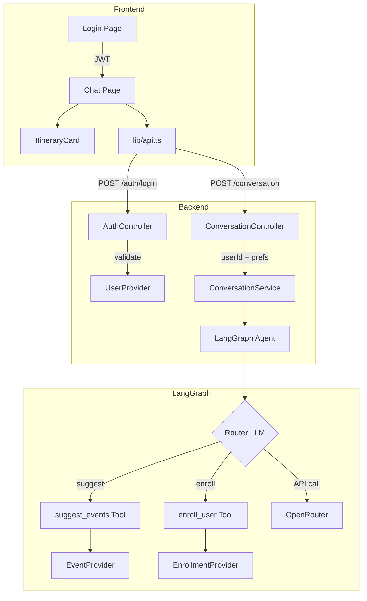
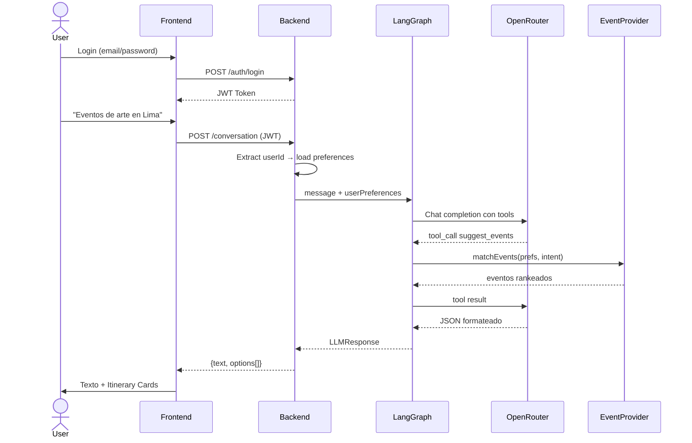

# Venti — AI Event Discovery Platform 🎉

Plataforma de descubrimiento de eventos impulsada por IA. Conversa con Venti para encontrar eventos personalizados según tus intereses, modifica tu itinerario y inscríbete.

## 🚀 Quick Start

### Prerequisites
- Docker & Docker Compose
- OpenRouter API Key ([get one here](https://openrouter.ai))
- `mkcert` (for local HTTPS development)

### 1. Configure HTTPS (mkcert)
Local HTTPS is **required** for Web Push Notifications and Service Workers.

```bash
# 1. Install mkcert (if not installed)
brew install mkcert
mkcert -install

# 2. Generate local certificates in Venti directory
mkdir -p certs && cd certs
mkcert localhost 127.0.0.1 ::1
```
This generates `localhost+2.pem` and `localhost+2-key.pem` inside the `certs/` folder, which Docker mounts automatically.

### 2. Configure Environment

```bash
# Backend: Set your OpenRouter API key and VAPID Keys
echo "OPENROUTER_API_KEY=your-key-here" >> backend/.env

# Optionally generate your own VAPID keys for web push:
# cd backend && npx web-push generate-vapid-keys
```

### 3. Run with Docker

```bash
docker compose up --build
```

- **Frontend**: https://localhost:3000
- **Backend**: https://localhost:4000

### 4. Login

Use one of the demo accounts:

| Email | Password | Role |
|-------|----------|------|
| `ana@example.com` | `password123` | User |
| `carlos@example.com` | `password123`| User |
| `maria@example.com` | `password123` | User |
| `diego@example.com` | `password123` | User |
| `admin@venti.com` | `admin123` | **Admin** |

---

## 🏗 Architecture

```
Venti/
├── docker-compose.yml
├── frontend/              # NextJS 16 + TypeScript
│   ├── src/
│   │   ├── app/
│   │   │   ├── login/     # Auth page
│   │   │   ├── chat/      # Main chat interface
│   │   │   └── globals.css # Dark theme design system
│   │   ├── components/
│   │   │   └── ItineraryCard.tsx
│   │   └── lib/
│   │       ├── api.ts     # Unified API client
│   │       └── env.ts     # Centralized env config
│   └── .env.local
├── backend/               # NestJS + LangGraph
│   ├── src/
│   │   ├── auth/          # JWT authentication
│   │   ├── conversation/  # LangGraph AI module
│   │   │   ├── graph/
│   │   │   │   ├── agent.graph.ts    # StateGraph
│   │   │   │   └── tools/
│   │   │   │       ├── suggest-events.tool.ts
│   │   │   │       └── enroll-user.tool.ts
│   │   │   ├── conversation.service.ts
│   │   │   └── conversation.controller.ts
│   │   ├── providers/     # JSON data providers
│   │   │   ├── user.provider.ts
│   │   │   ├── event.provider.ts
│   │   │   └── enrollment.provider.ts
│   │   └── common/types/  # Shared TypeScript types
│   ├── data/
│   │   ├── users.json     # 4 demo users
│   │   ├── events.json    # 18 events
│   │   └── enrollments.json
│   └── .env
└── README.md
```

## 🧩 Arquitectura de Software

El proyecto usa una **Layered Architecture** (arquitectura en capas) con el patrón **Provider** para acceso a datos:

```
┌──────────────────────────────────────────────────────────┐
│                    PRESENTACIÓN (NextJS)                  │
│  Login Page → Chat Page → ItineraryCard Components       │
│  lib/env.ts (config) → lib/api.ts (HTTP client unificado)│
└───────────────────────┬──────────────────────────────────┘
                        │ REST (JWT Bearer)
┌───────────────────────▼──────────────────────────────────┐
│                    CONTROLADORES (NestJS)                 │
│  AuthController (/auth/login)                            │
│  ConversationController (/conversation) ← JwtAuthGuard   │
└───────────────────────┬──────────────────────────────────┘
                        │
┌───────────────────────▼──────────────────────────────────┐
│                    SERVICIOS (Business Logic)             │
│  ConversationService (session management, context inject) │
└───────────────────────┬──────────────────────────────────┘
                        │
┌───────────────────────▼──────────────────────────────────┐
│              ORQUESTACIÓN IA (LangGraph StateGraph)       │
│  Agent Node → [suggest_events | enroll_user] → Agent     │
│                      ↕ OpenRouter API                    │
└───────────────────────┬──────────────────────────────────┘
                        │
┌───────────────────────▼──────────────────────────────────┐
│                 PROVIDERS (Data Access Layer)             │
│  UserProvider (users.json)                               │
│  EventProvider (events.json) ← match scoring algorithm   │
│  EnrollmentProvider (enrollments.json) ← write/read      │
└──────────────────────────────────────────────────────────┘
```

### Patrones de Diseño

| Patrón | Dónde | Propósito |
|--------|-------|-----------|
| **Layered Architecture** | Controller → Service → Provider | Separación de responsabilidades por capa |
| **Provider Pattern** | `UserProvider`, `EventProvider`, `EnrollmentProvider` | Acceso a datos JSON sin DB, fácilmente reemplazable |
| **Guard Pattern** | `JwtAuthGuard` en rutas protegidas | Autenticación declarativa por decorador |
| **Tool-based Agent** | LangGraph con tools dinámicos | El LLM decide qué herramientas usar según intención |
| **Session-per-user** | `ConversationService` con Map en memoria | Historial de conversación por usuario |
| **Unified API Client** | `lib/api.ts` centraliza fetch + auth | Punto único de acceso al backend |
| **Response Schema** | `LLMResponse { text?, options? }` | Contrato estandarizado entre backend y frontend |
| **Global Module** | `ProvidersModule` con `@Global()` | Inyección de dependencias disponible en toda la app |

### Diagrama de Flujo (Mermaid)





## 📡 API Endpoints

### Auth
| Method | Endpoint | Body | Auth | Response |
|--------|----------|------|------|----------|
| POST | `/auth/login` | `{ email, password }` | ❌ | `{ access_token, user }` |

### Conversation
| Method | Endpoint | Body | Auth | Response |
|--------|----------|------|------|----------|
| POST | `/conversation` | `{ message }` | ✅ JWT | `{ text?, options? }` |
| DELETE | `/conversation/session` | — | ✅ JWT | `{ message }` |

### Response Schema

```typescript
interface LLMResponse {
  text?: string;       // Conversational text
  options?: OptionItem[];  // Event cards (when applicable)
}

interface OptionItem {
  id: string;
  title: string;
  description: string;
  imageUrl: string;
  matchPercentage: number;
  tags: string[];
  date: string;
  time: string;
  location: string;
  price: string;
  category: string;
  enrolled: boolean;
  saved: boolean;
}
```

## 🧠 LangGraph Flow

The AI agent uses a **StateGraph** with these nodes:

1. **Router (Agent)** — LLM determines intent and calls tools
2. **suggest_events** — Matches events to user preferences (tag overlap + location + interests)
3. **enroll_user** — Confirms enrollment and persists to JSON
4. **Loop** — After tool execution, control returns to the agent for response formatting

### Tools

| Tool | Trigger | Action |
|------|---------|--------|
| `suggest_events` | "Sugiereme eventos", "Sorpréndeme", confirmar intereses, pedir categoría | Queries EventProvider, scores matches, returns max 3 |
| `enroll_user` | "Inscríbeme", "Confirmo", "Apuntame" | Writes to enrollments.json |

### Flujo de Respuesta (Response Flow)

```
1. Frontend: endpoints.chat(message) → POST /conversation + JWT

2. ConversationController.chat(req, body)
   → Extrae userId del JWT
   → Llama conversationService.chat(userId, message)

3. ConversationService.chat()
   → userProvider.getUserPreferences(userId)       ← users.json
   → getOrCreateSession(userId)                     ← Map en memoria
   → configService.get('OPENROUTER_API_KEY')        ← .env
   → runConversation(message, history, prefs, ...)  ← LangGraph

4. runConversation() — agent.graph.ts
   ├─ ChatOpenAI({ baseURL: openrouter })
   ├─ createSuggestEventsTool(eventProvider)
   ├─ createEnrollUserTool(enrollmentProvider)
   ├─ model.bindTools(tools)
   │
   ├─ graph.invoke(messages)                ← StateGraph execution
   │   ├─ START → agent node (LLM decides)
   │   ├─ shouldContinue() → tool_calls?
   │   │   ├─ YES → tools node
   │   │   │   ├─ suggest_events → eventProvider.matchEvents()
   │   │   │   └─ enroll_user → enrollmentProvider.enrollUser()
   │   │   └─ → back to agent node (loop)
   │   └─ NO → END
   │
   ├─ extractOptionsFromMessages()          ← Parse ToolMessage results
   │
   ├─ looksLikeHallucinatedEvents()?        ← Fallback detection
   │   └─ YES → eventProvider.matchEvents() directo
   │
   ├─ options.slice(0, 3)                   ← Max 3 results
   │
   └─ formatResponseWithLLM()              ← 2nd LLM call
       └─ Separa text de options (sin duplicación)

5. ConversationService (post-graph)
   → session.history.push(messages)         ← Memoria temporal
   → Limita a últimos 20 mensajes

6. Frontend: parseResponse(raw)
   → Safety parser (limpia JSON filtrado en text)
   → Renderiza text + ItineraryCard[]
```

**Almacenamiento de mensajes:** En memoria (`Map<userId, session>`). Se borran al reiniciar el servidor.

## 🎨 Features

- **Light Blue Theme** — Minimalist, soft blue backgrounds with royal blue accents and glassmorphism.
- **Push Notifications** — Real-time Web Push alerts using Service Workers and native Push API.
- **Admin Dashboard** — Route to `https://localhost:3000/admin` to send push notifications to everyone.
- **Itinerary Cards** — Photo, match %, tags, enroll/save/cancel buttons.
- **"Sorpréndeme" Button** — One-click event discovery.
- **Voice TTS & Speech Input** — Escucha la IA en español y dictale por voz.
- **My Events** — View and manage your enrollments on a dedicated page.
- **Conversation Memory** — Per-user session with last 20 messages.

## ⚙️ Environment Variables

### Backend (`.env`)
| Variable | Description | Default |
|----------|-------------|---------|
| `PORT` | Server port | `4000` |
| `JWT_SECRET` | JWT signing key | `venti-secret` |
| `OPENROUTER_API_KEY` | OpenRouter API key | — |
| `OPENROUTER_MODEL` | LLM model | `google/gemini-2.0-flash-001` |
| `FRONTEND_URL` | CORS origin | `http://localhost:3000` |

### Frontend (`.env.local`)
| Variable | Description | Default |
|----------|-------------|---------|
| `NEXT_PUBLIC_API_URL` | Backend URL | `http://localhost:4000` |

## 🛠 Development (without Docker)

```bash
# Backend
cd backend && npm install && npm run start:dev

# Frontend  
cd frontend && npm install && npm run dev
```
